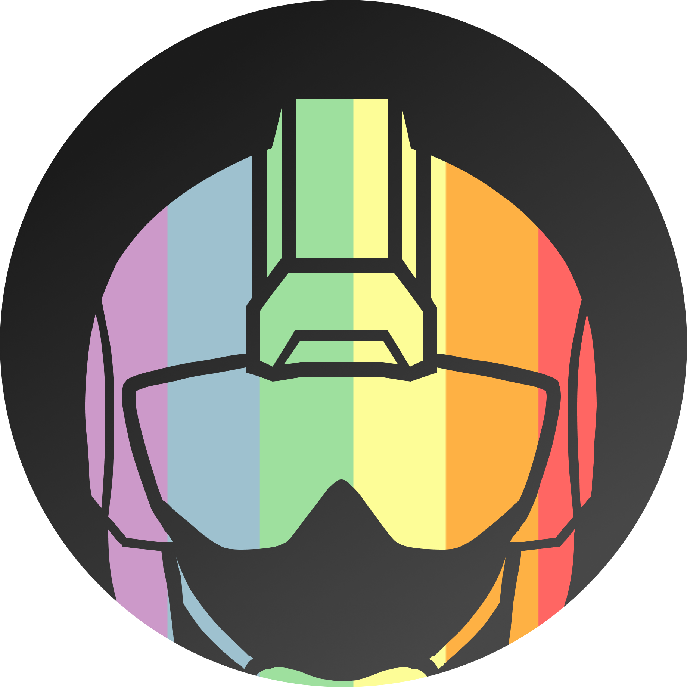
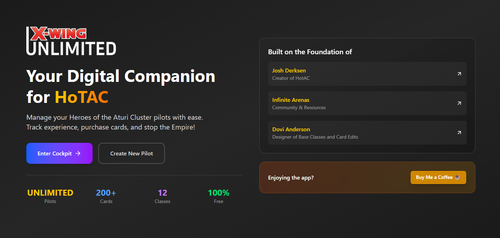

# X-Wing Unlimited
> Project by Roman Pretty
> 

Welcome to X-Wing Unlimited, a web application for managing and viewing your HotAC Characters!

This project aims to provide a modern, user-friendly interface for browsing, filtering, and managing cards, pilots, ships, and upgrades for the X-Wing Miniatures Game.

<br/>
<div style="text-align: center; width: 100%; ">
  
</div>
<br/>

## Running the Application

### Deployed Application (Recommended)
You can access the project at: [https://xwingunlimited.com](https://xwingunlimited.com/)

### Local Installation
To run X-Wing Unlimited locally:

#### Prerequisites
- [Node.js](https://nodejs.org/) (v16 or later recommended)
- [npm](https://www.npmjs.com/) or [yarn](https://yarnpkg.com/)

#### Setup
1. Clone this repository or download the source code.
2. Navigate to the root directory and install dependencies:
	```
	npm install
	# or
	yarn install
	```
3. Start the development server:
	```
	npm run dev
	# or
	yarn dev
	```
4. Open your browser and go to [http://localhost:5173](http://localhost:5173) (or the port shown in your terminal).

## Navigating the Source Code

- The main frontend code is in `src/`.
- Components are organized by feature in `src/components/`.
- Card, pilot, and ship data is in `src/data/`.
- Images and assets are in `public/` and `src/assets/`.

### Key Technologies
- [Vue 3](https://vuejs.org/)
- [Vite](https://vitejs.dev/)
- [Pinia](https://pinia.vuejs.org/)
- [Vue Router](https://router.vuejs.org/)

## Contributing
Contributions are welcome! Please open an issue or submit a pull request.

## License
This project is for personal and educational use. Not affiliated with Fantasy Flight Games or Atomic Mass Games. All X-Wing Miniatures Game assets are property of their respective owners.
